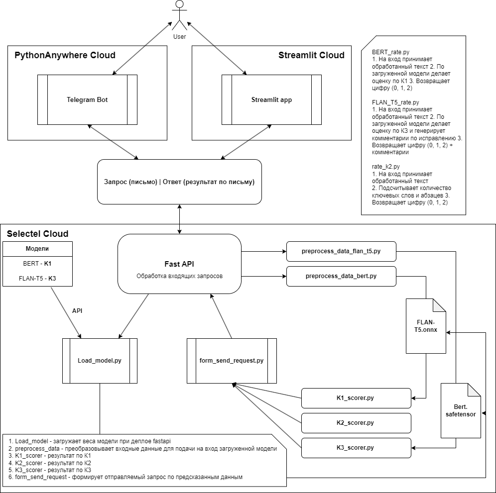

# Оценка уровня Writing по критериям ЕГЭ

 **Куратор**: Вольф Елена  
 **Студенты**: Бурлова Альбина, Андрейко Максим, Василенко Павел.

Письмо ЕГЭ по английскому языку — одно из заданий с развернутым ответом письменной части экзамена. Данное задание содержит отрывок письма от друга по переписке. Предлагается написать ответ с соблюдением определенных критериев:

К1 - Решение коммуникативной задачи (даны ответы + заданы вопросы + вежливость и стиль);  
К2 - Организация текста (количество абзацев + логичность);  
К3 - Языковое оформление текста (грамматика + лексика + пунктуация).

По каждому критерию выставляется от 0 до 2 баллов. В общей сумме можно получить максимум 6 баллов.  
Более подробно по критерии: https://disk.yandex.ru/i/3pNnqUuh3D887w

 Создан сервис (API) и подключенный к нему UI (streamlit-приложение и телеграм-бот), которые оценивают ответы к заданиям части Writing в ЕГЭ по английскому языку, выставляя баллы по критериям ЕГЭ. 

**Ссылки**:

- [Dataset](https://docs.google.com/spreadsheets/d/1m0mc1H7ULIZ2HEkT4dha_XRmRjt0gWJ8aht_GJ2lxfw/edit#gid=0)
- [EDA](https://app-for-autograde-eng-letter.streamlit.app)
- [Streamlit app](https://app-for-autograde-eng-letter.streamlit.app)
- [Telegram bot](https://t.me/letter_checker_bot)
- [Generated Data - OpenAI API](https://disk.yandex.ru/d/j9CCiZQFpZMTPQ)
- [Fine-tuned BERT](https://disk.yandex.ru/d/5MBlWdXOSiJWuw), [FLAN-T5](https://disk.yandex.ru/d/m8rbGP77RMLoBg)
- [Presentation_checkpoint](https://docs.google.com/presentation/d/1PtJqikiQ3EUEXvgTK1vLnINgrxvi6gEi4r01fm_CkXY/edit?usp=sharing)
- [Presentation_final](https://docs.google.com/presentation/d/1XN5nZ7-APyK1UBGcBQUd1PHvc88DmyqGRYKAIUfePZ4/edit#slide=id.g2be239d379d_0_45)

# Демонстрация работы сервиса

**Streamlit**:  

**Telegram bot**:  

# Архитектура сервиса
 

Организация проекта
------------

    ├── LICENSE
    ├── README.md                                <- Описание проекта
    ├── setup.py                                 <- Файл для установки проекта как пакета, 
    │                                            содержит информацию о версии, описании, авторах и лицензии
    ├── Checkpoint.pdf                           <- Презентация проекта
    │
    │
    ├── src/data                                 <- Код для парсинга, чтения, загрузки данных
    │   ├── __init__.py                          <- Для инициализации папки как модуля
    │   ├── parser_email_cloudtext.py            <- Парсер писем с ресурса cloudtext
    │   ├── parser_emails_reshu_ege.py           <- Парсер писем с ресурса РЕШУ ЕГЭ
    │   └── read_raw_data.py                     <- Чтение данных из gsheet
    │
    │
    ├── production                               <- Git-субмодули с исходным кодом сервисов продуктивизации
    │   ├── autograde_api                        <- API-сервис для обработки запросов
    │   ├── EGE-Writing-Autograde-Bot            <- Телеграм-бот для проверки писем
    │   ├── Streamli-for-autograde-eng-letter    <- Web-UI для использования модели, и EDA
    │   └── docker-compose.yaml                  <- Файл docker-compose для распаковки всего проекта
    │
    │
    ├── notebooks                                <- Jupyter-ноутбуки 
    │   ├── eda                                  <- Разведочный анализ данных
    │   ├── model_selection                      <- Ноутбуки с подбором моделей
    │   ├── openai_api                           <- Генерация данных с помощью OpenAI API
    │   ├── parsing                              <- Ноутбуки с парсингом данных
    │   └── email_data.csv                       <- Рабочий датасет
    │
    │
    └── images                                   <- Изображения, использованные в README.md

--------
